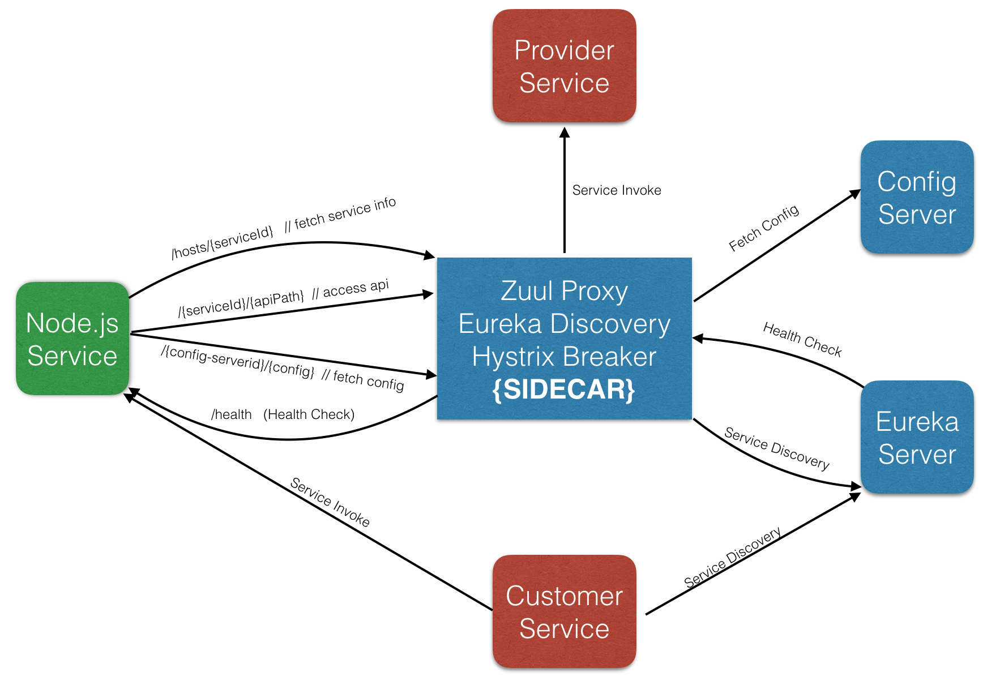

# Spring Cloud Examples

## Introduce

This project keep a record that how we use spring cloud to build microservice in our environments.

Here is the architect:

<center></center>

## Eureka

### build

```shell
gradle build
```

## Sidecar

### build

```
mvn package
```

## Config Server

### build

```
mvn package
```
